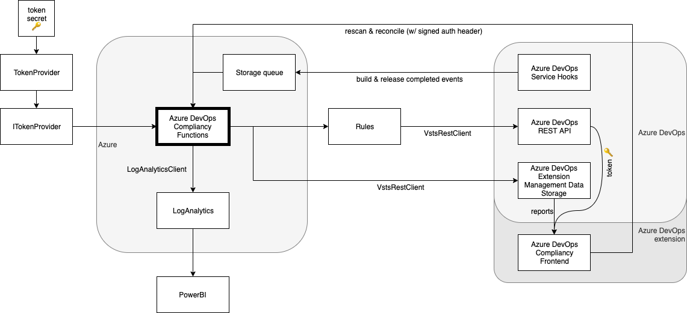

## Setup

### Functions

type            | function
----------------|----------
Time-triggered  | compliancy check van projecten, repo's en pipelines
Http-triggered  | rescan van compliancy van project
Event-triggered | compliancy check van build & release pipelines
Non-triggered   | het opnieuw proberen van messages in de poison-queue
Time-triggered  | controleren van compleetheid van de compliancy check

### Rules

Functionele rules voor het controleren en oplossen van compliancy van projecten.

### VstsRestClient

Hand-rolled mockable REST client voor Azure DevOps.

### LogAnalyticsClient

Hand-rolled client voor wegschrijven en uitlezen van records in LogAnalytics.

### Frontend

Azure DevOps frontend extension voor het weergeven van compliancy reports en uitvoeren van reconcile en rescan.

## Shared Secret gebruikt in Tokenizer

Het authorization header dat meekomt vanuit de compliancy frontend in Azure DevOps is signed met het secret van de 
extension en daarop wordt gecontroleerd in de `Tokenizer`. Dit secret wordt meegegeven als secret variable in de pipeline
bij de deployment van de functions.

Mocht je het secret ooit opnieuw nodig hebben, dan kan je deze downloaden in de https://marketplace.visualstudio.com:

